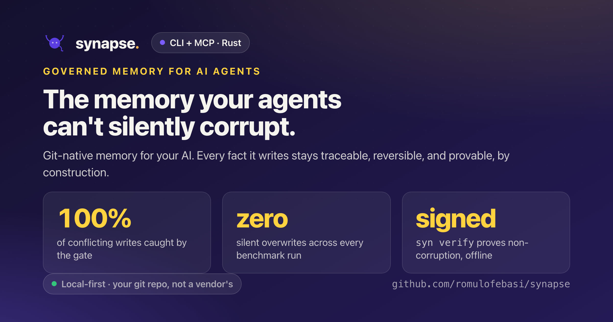
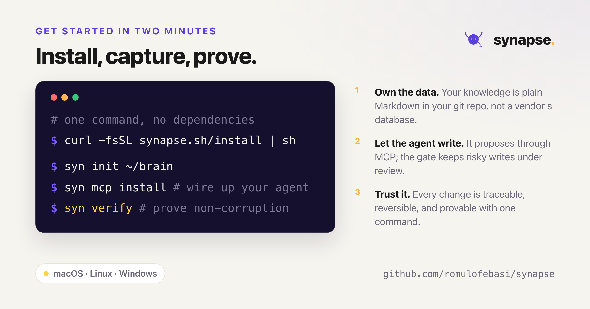

<div align="center">



<br/><br/>

[](https://github.com/romulofebasi/synapse-releases/releases/latest)
[](#install)
[](https://modelcontextprotocol.io)
[](LICENSE)

**[Install](#install)** · **[Why it matters](#why-it-matters)** · **[The proof](#the-proof)** · **[First steps](#first-steps)** · **[For your AI](#for-your-ai-assistant)**

</div>

---

## What Synapse is

Synapse is a memory layer for AI agents that you own and can trust. It keeps what you know
about each project, such as APIs, people, decisions, tasks, and runbooks, as plain Markdown
files in your own git repository. Your assistant reads and writes that knowledge through a
standard [MCP](https://modelcontextprotocol.io) connection, and you work with it from a fast
terminal command called `syn`.

Most memory tools stop at storage. Synapse is built around a harder question: **when an AI
writes to your knowledge, can you prove it did not quietly corrupt it?** Every fact the
assistant writes carries a signed record of what changed, when, and on whose behalf. Nothing
is hidden and nothing is permanent. You can trace any change, undo it, and run one command
that produces a signed report proving the memory still matches its history.

This is something a hosted memory service cannot offer, because the ledger lives in your
repository rather than on their servers. Your knowledge stays local, portable, and yours.

---

## Why it matters

Give an assistant write access to shared knowledge and the real risk is not a dramatic
failure. It is quiet drift: one confident wrong fact that is never flagged and is trusted
from then on. The industry answer is better automatic correction. Synapse takes a different
position: a memory you can audit, roll back, and prove uncorrupted. Four guarantees do the
work.

- **Provenance on every fact.** Accepted AI entities carry inline `x-ai-*` stamps, with a
  full history chain when a fact changes again. `syn blame` walks the lineage and `syn diff`
  shows the field by field before and after.
- **Reversible by construction.** Markdown is the source of truth and git holds the history.
  `syn at <ref>` travels the graph back in time and `syn audit replay` re-derives a proposal.
- **Tamper evident and git native.** An append only audit trail rides git's own integrity
  guarantees. `syn audit verify` re-hashes the trail against every payload.
- **Provable, not just auditable.** `syn verify` produces a signed, reproducible report that
  confirms the index is a faithful rebuild of your Markdown, the audit chain is intact, and
  no fact was silently overwritten. It runs fully offline.

Protecting your memory from a conflicting write happens in two independent layers. A capable
agent notices the conflict and asks you first. When it does not, the deterministic gate
catches the write and holds it for review.

<div align="center">

</div>

---

## The proof

Claims are easy. Synapse ships a benchmark that drives a real AI agent, Claude Code, through
the full memory loop over MCP, then grades the memory it leaves behind rather than the
conversation.

<div align="center">

</div>

Retrieval also stays reliable as the amount of noise grows. The right answer keeps surfacing
even as thousands of unrelated notes pile into the same workspace.

<div align="center">

</div>

---

## Install

### One-liner (macOS, Linux)

```bash
curl -fsSL https://raw.githubusercontent.com/romulofebasi/synapse-releases/main/install.sh | sh
```

Detects your OS and CPU, downloads the right binary, drops `syn` into `/usr/local/bin/`
(override with `INSTALL_DIR=~/.local/bin`), and clears the macOS Gatekeeper attribute for
you. Pin a version with `SYNAPSE_VERSION=v1.0.0`.

### Windows (PowerShell)

```powershell
$ver = "v1.0.0"   # latest tag from the releases page
$url = "https://github.com/romulofebasi/synapse-releases/releases/download/$ver/synapse-$($ver.Substring(1))-x86_64-pc-windows-msvc.zip"
$tmp = "$env:TEMP\synapse.zip"
Invoke-WebRequest $url -OutFile $tmp
Expand-Archive $tmp -DestinationPath $env:TEMP -Force
Move-Item "$env:TEMP\synapse-$($ver.Substring(1))-x86_64-pc-windows-msvc\syn.exe" "$HOME\bin\syn.exe" -Force
```

### Manual download

Pick your platform from the [latest release](https://github.com/romulofebasi/synapse-releases/releases/latest),
extract, and put `syn` (or `syn.exe`) on your `PATH`.

| OS | Architecture | Asset |
|---|---|---|
| macOS | Apple Silicon (M1+) | `synapse-<version>-aarch64-apple-darwin.tar.gz` |
| Linux | x86_64 | `synapse-<version>-x86_64-unknown-linux-gnu.tar.gz` |
| Linux | ARM64 | `synapse-<version>-aarch64-unknown-linux-gnu.tar.gz` |
| Windows | x86_64 | `synapse-<version>-x86_64-pc-windows-msvc.zip` |

> **Intel Macs (`x86_64`) are not supported.** The ONNX Runtime behind Synapse's semantic
> search ships no Intel-macOS build, so there is no binary for that target. Apple Silicon
> (M1+) is the only supported Mac.

---

## Requirements

`syn` is a single self-contained binary. No runtime, no Python, no system SQLite. The
semantic-search features add a one-time model download, on your consent, not a heavier
install.

| | Detail |
|---|---|
| **Disk** | ~25 MB binary. Semantic search downloads **~2.5 GB** of models on first use (once, shared across workspaces). See [MODELS.md](./MODELS.md). Without it you still get keyword and graph search and the full MCP server. |
| **Linux** | Semantic search needs **glibc ≥ 2.38**, meaning Ubuntu 24.04+, Debian 13+, Fedora 39+. On older distros `syn` installs and runs (CLI, MCP, keyword and graph search); only meaning search needs a newer base. |
| **Network** | Only the one-time model download (from Hugging Face) ever leaves your machine. Your notes, entities, and queries stay local. Synapse ships **no telemetry**. |

---

## First steps

<div align="center">

</div>

```bash
syn init ~/brain && cd ~/brain
syn project add "Payments Platform"
syn person  add "Maria Silva" --email maria@company.com --job-title "Tech Lead"
syn search  payments
```

Now connect your assistant. One command wires Synapse into Claude Code, and the next
conversation can answer questions using your facts, not guesses. Then prove the memory is
intact:

```bash
syn mcp install        # register Synapse with your MCP client
syn verify             # produce a signed report that nothing was corrupted
```

The full walkthrough, covering entities, the graph, semantic search, and the propose and
accept loop, is in **[ONBOARDING.md](./ONBOARDING.md)**.

---

## For your AI assistant

Synapse is built to be driven by an AI over [MCP](https://modelcontextprotocol.io)
(`syn mcp`). To teach Claude, or any agent, the right and token-efficient way to use it,
which read tool to pick, how to route across workspaces, and the rule that the AI only
*proposes* writes while you accept them, two machine-oriented files ship here.

- **[`skills/synapse/SKILL.md`](./skills/synapse/SKILL.md)** is a portable
  [Agent Skill](https://agentskills.io), the open standard used by Claude Code, the Claude
  apps and API, and other agents. The binary installs it for you with `syn skill install`,
  or copy it once:

  ```bash
  # Claude Code / Claude, personal (all projects):
  mkdir -p ~/.claude/skills && cp -r skills/synapse ~/.claude/skills/synapse
  # or per-project: cp -r skills/synapse .claude/skills/synapse
  ```

- **[`LLM.md`](./LLM.md)** is an [`llms.txt`](https://llmstxt.org)-style orientation file.
  Point any agent at it to give it a concise, accurate picture of Synapse and its MCP tools.

---

## Gatekeeper and SmartScreen

The binaries are not yet code-signed. The one-line installer handles macOS for you. The
manual route:

- **macOS**: `xattr -dr com.apple.quarantine /usr/local/bin/syn`
- **Windows**: SmartScreen prompts once, then *More info, Run anyway*.
- **Linux**: nothing special.

Verify the bytes against the checksum on the release page:

```bash
shasum -a 256 ~/Downloads/synapse-*-*.tar.gz
```

---

## Docs

- **[ONBOARDING.md](./ONBOARDING.md)** from install to your first answer, step by step.
- **[MODELS.md](./MODELS.md)** semantic search, the on-device models, footprint, offline use, and privacy.
- **[LLM.md](./LLM.md)** the agent-facing orientation file.

---

## License

MIT. See [LICENSE](./LICENSE).

---

<div align="center">


<sub>Built with care by <a href="https://github.com/romulofebasi">Rômulo Febasi</a>.</sub>

</div>
