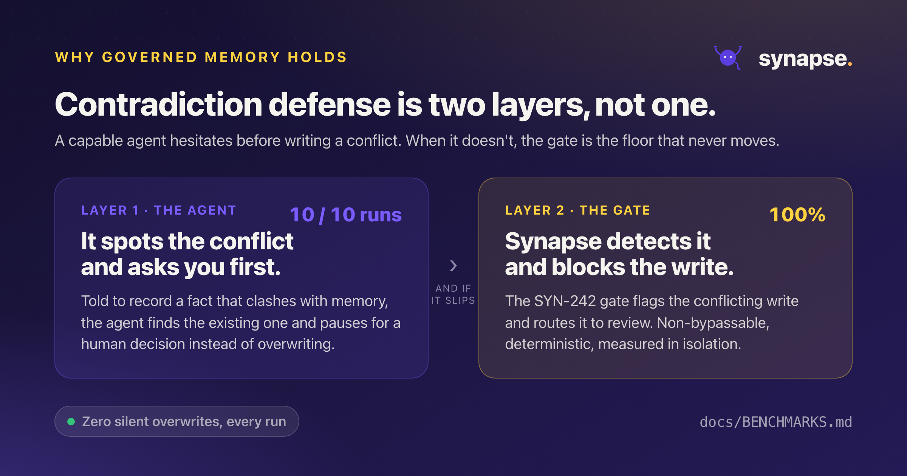

<div align="center">


<br/>

**The memory your AI agents can't silently corrupt.**

Git-native memory for AI agents. Traceable, reversible, and provable by construction.

[](https://github.com/romulofebasi/synapse-releases/releases/latest)
[](https://modelcontextprotocol.io)
[](LICENSE)

**[Install](#install)** · **[Why it matters](#why-it-matters)** · **[The proof](#the-proof)** · **[First steps](#first-steps)**

</div>

---

## What Synapse is

Synapse is a memory layer for AI agents that you own and can trust. It keeps what you know
about each project, such as APIs, people, decisions, tasks, and runbooks, as plain Markdown
in your own git repository. Your assistant reads and writes through a standard
[MCP](https://modelcontextprotocol.io) connection, and you drive it from a fast terminal
command, `syn`.

Most memory tools stop at storage. Synapse answers a harder question: **when an AI writes to
your knowledge, can you prove it did not quietly corrupt it?** Because the ledger lives in your
repository, not on a vendor's servers, your knowledge stays local, portable, and yours.

---

## Why it matters

The industry answer to bad AI writes is better automatic correction. Synapse takes a different
position: a memory you can audit, roll back, and prove uncorrupted. Every write travels one
governed path.

<div align="center">

</div>

| Guarantee | Command | What it proves |
|---|---|---|
| **Provenance on every fact** | `syn blame` · `syn diff` | What the AI touched, when, and on whose behalf |
| **Reversible by construction** | `syn at <ref>` · `syn audit replay` | Nothing written is something you cannot trace back and undo |
| **Tamper evident, git native** | `syn audit verify` | The audit trail rides git's own integrity guarantees |
| **Provable, not just auditable** | `syn verify` | A signed, offline report that no fact was silently overwritten |

---

## The proof

Synapse ships a benchmark that drives a real agent, Claude Code, through the full memory loop
over MCP, then grades the memory it leaves behind rather than the conversation. All numbers are
owner-run and reproducible.

| Scenario | What it measures | Result |
|---|---|---|
| **Insertion** | extract the fact, resist chit-chat, save it | pass@1 **80%** (CI 55 to 93%) |
| **Correction** | update the existing entity, no duplicate | pass@1 **88%** |
| **Contradiction, agent** | non-corruption when a conflicting claim arrives | **100%** across every run |
| **Contradiction, gate** | the deterministic gate detects and blocks, in isolation | **100%** detect and block |
| **Retrieval under noise** | the right answer survives thousands of distractors | recall@10 **100%**, e2e **100%** |

Contradiction defense is **two independent layers**. A capable agent notices the conflict and
asks first. When it does not, the deterministic gate catches the write and holds it for review.

<div align="center">

</div>

Retrieval stays reliable as noise grows. The right answer keeps surfacing even as thousands of
unrelated notes pile into the same workspace.

<div align="center">

</div>

It also stays sharp at the top of the list. As six professionals' full quarters pile into one
workspace, the right fact is answer number one 85 percent of the time (up from 78 percent
before passage-level embeddings) and is in the top ten on every tier.

<div align="center">

</div>

New to these terms? The [**plain-language guide**](BENCHMARKS_EXPLAINED.md) explains e2e, the
gate, recall@10, distractors, and where the benchmark is honestly weak, in English and
Portuguese.

---

## Install

### One-liner (macOS, Linux)

```bash
curl -fsSL https://raw.githubusercontent.com/romulofebasi/synapse-releases/main/install.sh | sh
```

Detects your OS and CPU, downloads the right binary, drops `syn` into `/usr/local/bin/`
(override with `INSTALL_DIR=~/.local/bin`), and clears the macOS Gatekeeper attribute for you.
Pin a version with `SYNAPSE_VERSION=v1.0.0`.

### Windows (PowerShell)

```powershell
$ver = "v1.0.0"   # latest tag from the releases page
$url = "https://github.com/romulofebasi/synapse-releases/releases/download/$ver/synapse-$($ver.Substring(1))-x86_64-pc-windows-msvc.zip"
$tmp = "$env:TEMP\synapse.zip"
Invoke-WebRequest $url -OutFile $tmp
Expand-Archive $tmp -DestinationPath $env:TEMP -Force
Move-Item "$env:TEMP\synapse-$($ver.Substring(1))-x86_64-pc-windows-msvc\syn.exe" "$HOME\bin\syn.exe" -Force
```

### Manual download

Pick your platform from the [latest release](https://github.com/romulofebasi/synapse-releases/releases/latest),
extract, and put `syn` (or `syn.exe`) on your `PATH`.

| OS | Architecture | Asset |
|---|---|---|
| macOS | Apple Silicon (M1+) | `synapse-<version>-aarch64-apple-darwin.tar.gz` |
| Linux | x86_64 | `synapse-<version>-x86_64-unknown-linux-gnu.tar.gz` |
| Linux | ARM64 | `synapse-<version>-aarch64-unknown-linux-gnu.tar.gz` |
| Windows | x86_64 | `synapse-<version>-x86_64-pc-windows-msvc.zip` |

> **Intel Macs (`x86_64`) are not supported.** The ONNX Runtime behind Synapse's semantic
> search ships no Intel-macOS build. Apple Silicon (M1+) is the only supported Mac.

---

## Requirements

`syn` is a single self-contained binary. No runtime, no Python, no system SQLite. Semantic
search adds a one-time model download, on your consent, not a heavier install.

| | Detail |
|---|---|
| **Disk** | ~25 MB binary. Semantic search downloads **~2.5 GB** of models on first use (once, shared across workspaces). See [MODELS.md](./MODELS.md). Without it you still get keyword and graph search and the full MCP server. |
| **Linux** | Semantic search needs **glibc ≥ 2.38** (Ubuntu 24.04+, Debian 13+, Fedora 39+). On older distros `syn` still installs and runs; only meaning search needs a newer base. |
| **Network** | Only the one-time model download (from Hugging Face) ever leaves your machine. Your notes, entities, and queries stay local. Synapse ships **no telemetry**. |

---

## First steps

```bash
syn init ~/brain && cd ~/brain
syn project add "Payments Platform"
syn person  add "Maria Silva" --email maria@company.com --job-title "Tech Lead"
syn search  payments
```

Connect your assistant, then prove the memory is intact:

```bash
syn mcp install        # register Synapse with your MCP client
syn verify             # signed report that nothing was corrupted
```

The full walkthrough is in **[ONBOARDING.md](./ONBOARDING.md)**.

---

## For your AI assistant

Synapse is built to be driven by an AI over [MCP](https://modelcontextprotocol.io) (`syn mcp`).
Two machine-oriented files teach any agent the right, token-efficient way to use it.

- **[`skills/synapse/SKILL.md`](./skills/synapse/SKILL.md)** is a portable
  [Agent Skill](https://agentskills.io). Install it with `syn skill install`, or copy once:

  ```bash
  mkdir -p ~/.claude/skills && cp -r skills/synapse ~/.claude/skills/synapse
  ```

- **[`LLM.md`](./LLM.md)** is an [`llms.txt`](https://llmstxt.org)-style orientation file. Point
  any agent at it for a concise, accurate picture of Synapse and its MCP tools.

---

## Gatekeeper and SmartScreen

The binaries are not yet code-signed. The one-line installer handles macOS for you.

- **macOS**: `xattr -dr com.apple.quarantine /usr/local/bin/syn`
- **Windows**: SmartScreen prompts once, then *More info, Run anyway*.
- **Linux**: nothing special.

Verify the bytes against the checksum on the release page:

```bash
shasum -a 256 ~/Downloads/synapse-*-*.tar.gz
```

---

## Docs

| Doc | What you get |
|---|---|
| [ONBOARDING.md](./ONBOARDING.md) | From install to your first answer, step by step |
| [MODELS.md](./MODELS.md) | Semantic search, the on-device models, footprint, offline use, privacy |
| [BENCHMARKS_EXPLAINED.md](./BENCHMARKS_EXPLAINED.md) | The benchmark in plain language, English and Portuguese |
| [LLM.md](./LLM.md) | The agent-facing orientation file |

---

## License

MIT. See [LICENSE](./LICENSE).

<div align="center">
<br/>


<sub>Built with care by <a href="https://github.com/romulofebasi">Rômulo Febasi</a>.</sub>

</div>
