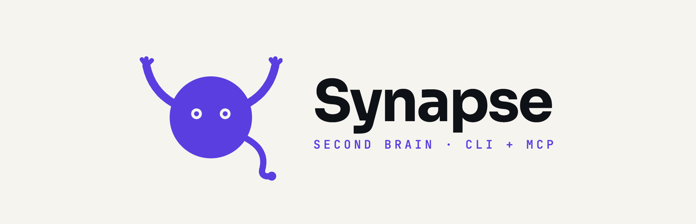
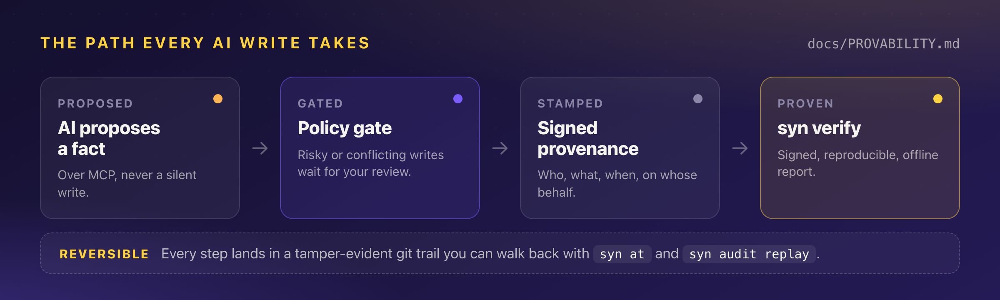
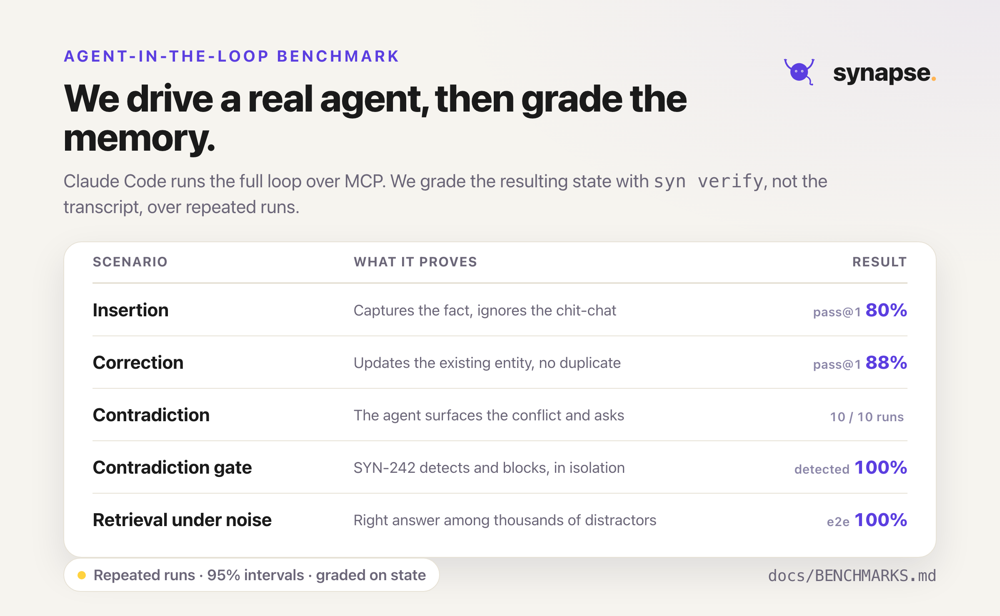
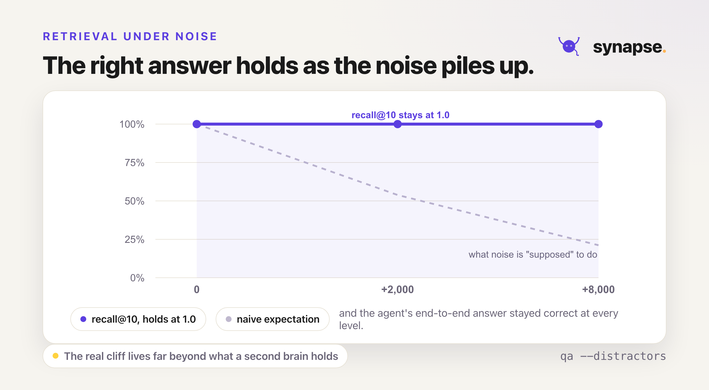
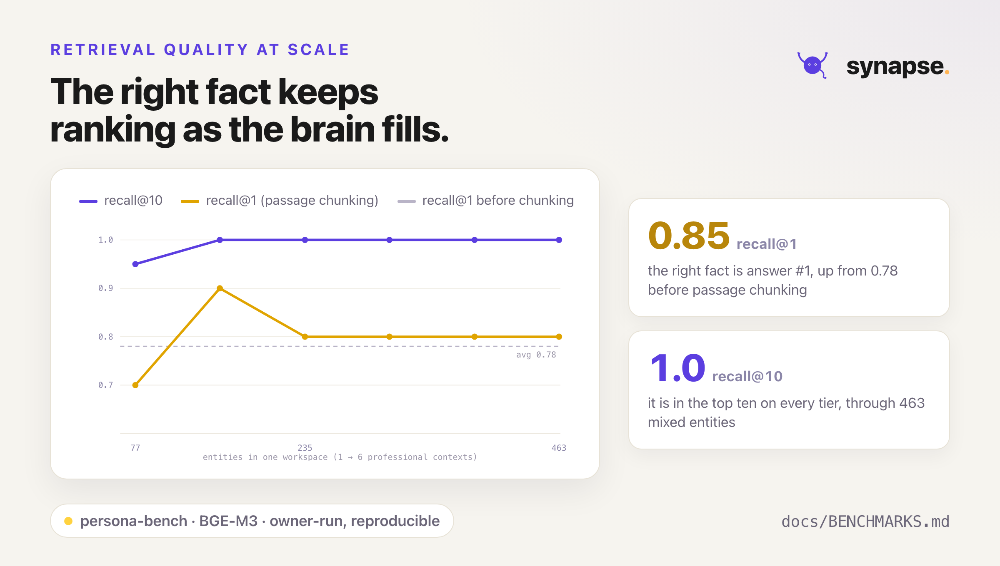

<div align="center">



<br/>

**The memory your AI agents can't silently corrupt.**

Git-native memory for AI agents. Traceable, reversible, and provable by construction.

[](https://github.com/romulofebasi/synapse-releases/releases/latest)
[](https://www.npmjs.com/package/@febasi/synapse)
[](https://modelcontextprotocol.io)
[](#verify-your-download)
[](#requirements)
[](LICENSE)

**[Install](#install)** · **[Why it matters](#why-it-matters)** · **[The proof](#the-proof)** · **[First steps](#first-steps)**

</div>

---

## What Synapse is

Synapse is a memory layer for AI agents that you own and can trust. It keeps what you know
about each project, such as APIs, people, decisions, tasks, and runbooks, as plain Markdown
in your own git repository. Your assistant reads and writes through a standard
[MCP](https://modelcontextprotocol.io) connection, and you drive it from a fast terminal
command, `syn`.

Most memory tools stop at storage. Synapse answers a harder question: **when an AI writes to
your knowledge, can you prove it did not quietly corrupt it?** Because the ledger lives in your
repository, not on a vendor's servers, your knowledge stays local, portable, and yours.

---

## Why it matters

The industry answer to bad AI writes is better automatic correction. Synapse takes a different
position: a memory you can audit, roll back, and prove uncorrupted. Every write travels one
governed path.

<div align="center">

</div>

| Guarantee | Command | What it proves |
|---|---|---|
| **Provenance on every fact** | `syn blame` · `syn diff` | What the AI touched, when, and on whose behalf |
| **Reversible by construction** | `syn at <ref>` · `syn audit replay` | Nothing written is something you cannot trace back and undo |
| **Tamper evident, git native** | `syn audit verify` | The audit trail rides git's own integrity guarantees |
| **Provable, not just auditable** | `syn verify` | A signed, offline report that no fact was silently overwritten |

<br/>

|  | Hosted AI memory | **Synapse** |
|---|:---:|:---:|
| Where your knowledge lives | vendor servers | **your git repository** |
| Non-corruption guarantee | estimated by an LLM judge | **proven, signed, offline** |
| Roll back a bad write | rarely, if ever | **`syn undo`, `syn at <ref>`** |
| Rebuild the state from source | impossible (the store is the source) | **`syn verify --rebuild`** |
| Time-travel to a past belief | no | **`syn search --as-of <date>`** |
| Runs offline, no account | usually no | **always** |
| Telemetry | common | **none** |

---

## The proof

Synapse ships a benchmark that drives a real agent (Claude Code) through the full memory loop
over MCP, then grades the memory it leaves behind, not the conversation. Every number is
owner-run and reproducible.

<div align="center">

</div>

<details>
<summary>Prefer the numbers as text, with confidence intervals?</summary>

| Scenario | What it measures | Result |
|---|---|---|
| **Insertion** | extract the fact, resist chit-chat, save it | pass@1 **80%** (CI 55 to 93%) |
| **Correction** | update the existing entity, no duplicate | pass@1 **88%** |
| **Contradiction, agent** | non-corruption when a conflicting claim arrives | **100%** across every run |
| **Contradiction, gate** | the deterministic gate detects and blocks, in isolation | **100%** detect and block |
| **Retrieval under noise** | the right answer survives thousands of distractors | recall@10 **100%**, e2e **100%** |

</details>

Contradiction defense is the headline, and it is **two independent layers**. A capable agent
notices the conflict and asks first. When it does not, the deterministic gate catches the write
and holds it for review. Across every run, no existing fact was ever silently overwritten.

Retrieval holds up as the workspace fills. It survives adversarial noise, and it stays sharp at
the very top of the list.

<table align="center">
<tr>
<td width="50%" valign="top" align="center">

<br /><sub><b>Survives noise.</b> recall@10 holds at 1.0 as distractors scale to 8,000. The dashed line is what naive retrieval would do.</sub>
</td>
<td width="50%" valign="top" align="center">

<br /><sub><b>Stays sharp.</b> the right fact is answer number one 85% of the time (up from 78% before passage chunking) and always in the top ten.</sub>
</td>
</tr>
</table>

> [!NOTE]
> **New to these terms?** The [plain-language guide](BENCHMARKS_EXPLAINED.md) explains e2e, the
> gate, recall@10, distractors, and where the benchmark is honestly weak, in English and
> Portuguese.

---

## Install

### npm (any platform with Node 18+)

```bash
npx @febasi/synapse init ~/brain      # run once, no install
npm install -g @febasi/synapse        # or install syn globally
```

npm installs the prebuilt binary for your platform as a package (no runtime download).
Published from the public mirror with
[npm provenance](https://docs.npmjs.com/generating-provenance-statements), so the link back to
this repo's build is verifiable on the package page.

### One-liner (macOS, Linux)

```bash
curl -fsSL https://raw.githubusercontent.com/romulofebasi/synapse-releases/main/install.sh | sh
```

Detects your OS and CPU, downloads the right binary, drops `syn` into `/usr/local/bin/`
(override with `INSTALL_DIR=~/.local/bin`), and clears the macOS Gatekeeper attribute for you.
Pin a version with `SYNAPSE_VERSION=v1.0.0`.

### Windows (PowerShell)

```powershell
$ver = "v1.0.0"   # latest tag from the releases page
$url = "https://github.com/romulofebasi/synapse-releases/releases/download/$ver/synapse-$($ver.Substring(1))-x86_64-pc-windows-msvc.zip"
$tmp = "$env:TEMP\synapse.zip"
Invoke-WebRequest $url -OutFile $tmp
Expand-Archive $tmp -DestinationPath $env:TEMP -Force
Move-Item "$env:TEMP\synapse-$($ver.Substring(1))-x86_64-pc-windows-msvc\syn.exe" "$HOME\bin\syn.exe" -Force
```

### Manual download

Pick your platform from the [latest release](https://github.com/romulofebasi/synapse-releases/releases/latest),
extract, and put `syn` (or `syn.exe`) on your `PATH`.

| OS | Architecture | Asset |
|---|---|---|
| macOS | Apple Silicon (M1+) | `synapse-<version>-aarch64-apple-darwin.tar.gz` |
| Linux | x86_64 | `synapse-<version>-x86_64-unknown-linux-gnu.tar.gz` |
| Linux | ARM64 | `synapse-<version>-aarch64-unknown-linux-gnu.tar.gz` |
| Windows | x86_64 | `synapse-<version>-x86_64-pc-windows-msvc.zip` |

> **Intel Macs (`x86_64`) are not supported.** The ONNX Runtime behind Synapse's semantic
> search ships no Intel-macOS build. Apple Silicon (M1+) is the only supported Mac.

---

## Requirements

`syn` is a single self-contained binary. No runtime, no Python, no system SQLite. Semantic
search adds a one-time model download, on your consent, not a heavier install.

| | Detail |
|---|---|
| **Disk** | ~25 MB binary. Semantic search downloads **~2.5 GB** of models on first use (once, shared across workspaces). See [MODELS.md](./MODELS.md). Without it you still get keyword and graph search and the full MCP server. |
| **Linux** | Semantic search needs **glibc ≥ 2.38** (Ubuntu 24.04+, Debian 13+, Fedora 39+). On older distros `syn` still installs and runs; only meaning search needs a newer base. |
| **Network** | Only the one-time model download (from Hugging Face) ever leaves your machine. Your notes, entities, and queries stay local. Synapse ships **no telemetry**. |

---

## First steps

```bash
syn init ~/brain && cd ~/brain
syn project add "Payments Platform"
syn person  add "Maria Silva" --email maria@company.com --job-title "Tech Lead"
syn search  payments
```

Connect your assistant, then prove the memory is intact:

```bash
syn mcp install        # register Synapse with your MCP client
syn verify             # signed report that nothing was corrupted
```

The full walkthrough is in **[ONBOARDING.md](./ONBOARDING.md)**.

---

## For your AI assistant

Synapse is built to be driven by an AI over [MCP](https://modelcontextprotocol.io) (`syn mcp`).
It exposes **25 tools** across five groups, and every write is a proposal that lands in your
review queue, never a silent commit.

| Group | Tools do what |
|---|---|
| **Read** | keyword, semantic, and cross-type search; graph and ego-graph; `blame` and `diff` on any fact; `workspace_health` |
| **Write (proposed)** | `capture_fact`, `link_entity`, `update_status`, tag and topic edits, all gated for review |
| **Audit and verify** | `verify` (the signed non-corruption report) and `replay_proposal` |
| **Federation** | search and read across many workspaces from one brain |
| **Maintenance** | `reindex` the disposable SQLite index from Markdown |

Two machine-oriented files teach any agent the right, token-efficient way to use it.

- **[`skills/synapse/SKILL.md`](./skills/synapse/SKILL.md)** is a portable
  [Agent Skill](https://agentskills.io). Install it with `syn skill install`, or copy once:

  ```bash
  mkdir -p ~/.claude/skills && cp -r skills/synapse ~/.claude/skills/synapse
  ```

- **[`LLM.md`](./LLM.md)** is an [`llms.txt`](https://llmstxt.org)-style orientation file. Point
  any agent at it for a concise, accurate picture of Synapse and its MCP tools.

---

## Verify your download

Every release ships a `SHA256SUMS` manifest signed with keyless
[Sigstore](https://www.sigstore.dev/) / cosign (no long-lived key, the signing identity is the
release workflow itself, logged in the public Rekor transparency ledger). npm builds carry
[provenance](https://docs.npmjs.com/generating-provenance-statements) on top. You can prove the
bytes came from this repo's build before you run them:

```bash
cosign verify-blob \
  --bundle SHA256SUMS.cosign.bundle \
  --certificate-identity-regexp '^https://github.com/romulofebasi/synapse/\.github/workflows/release\.yml@refs/tags/v' \
  --certificate-oidc-issuer 'https://token.actions.githubusercontent.com' \
  SHA256SUMS
sha256sum --check --ignore-missing SHA256SUMS   # your archive: OK
```

Full walkthrough in [VERIFYING-RELEASES.md](./VERIFYING-RELEASES.md).

> [!NOTE]
> Signing proves **provenance and integrity**. It is not Apple notarization or a Windows
> Authenticode certificate, so the OS still gatekeeps an unrecognized publisher on first run.
> The one-line installer clears macOS quarantine for you; otherwise:
> - **macOS**: `xattr -dr com.apple.quarantine /usr/local/bin/syn`
> - **Windows**: SmartScreen prompts once, then *More info, Run anyway*.
> - **Linux**: nothing special.

---

## Docs

| Doc | What you get |
|---|---|
| [ONBOARDING.md](./ONBOARDING.md) | From install to your first answer, step by step |
| [MODELS.md](./MODELS.md) | Semantic search, the on-device models, footprint, offline use, privacy |
| [BENCHMARKS_EXPLAINED.md](./BENCHMARKS_EXPLAINED.md) | The benchmark in plain language, English and Portuguese |
| [VERIFYING-RELEASES.md](./VERIFYING-RELEASES.md) | Prove a download is signed and untampered (cosign, provenance) |
| [LLM.md](./LLM.md) | The agent-facing orientation file |

---

## Contributing and feedback

Synapse is a closed-source product distributed through this public mirror. Bugs, ideas, and
questions are very welcome.

- **Found a bug?** [Open a bug report](https://github.com/romulofebasi/synapse-releases/issues/new?template=bug_report.yml).
- **Want a feature, or have an idea?** [Open a feature request](https://github.com/romulofebasi/synapse-releases/issues/new?template=feature_request.yml).
- **Docs or install script fix?** Those files live in this public repo and take pull requests. See [CONTRIBUTING.md](./CONTRIBUTING.md).
- **Security issue?** Please disclose it privately. See [SECURITY.md](./.github/SECURITY.md).

---

## License

MIT. See [LICENSE](./LICENSE).

<div align="center">
<br/>


<sub>Built with care by <a href="https://github.com/romulofebasi">Rômulo Febasi</a>.</sub>

</div>
